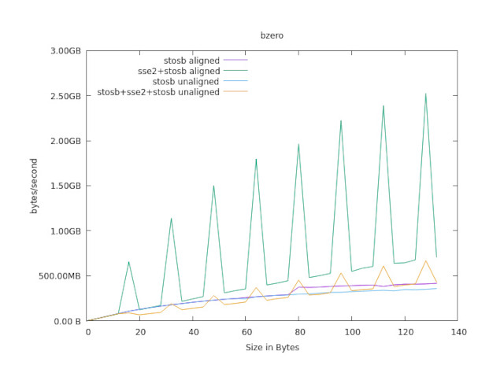

Assembly routines, replacements for standard libc functions.
Written for amd64, some make use of the mmx instruction sets.

Abi system V.(Linux,gcc)

They are originally part of another project, minilib.

I separate them here for some research.

Amongst other considerations I'm not that certain, having memory clobbers
is enough. It should. And I'd prefer to have no volatile 
asm statements.

The functions are moderately optimized, my main target is the resulting
binary's size.

Most of the routines are benchmarked, and way faster than (naive) c pendants.
(Up to 100 times).
However, the benchmarks are more sort of an educated guess,
and I'm aiming first hand for size optimization.


In the folder devel I collect experiments, which showed up to either don't work,
or not giving any advantage. 
Possibly they are of some other use.

----

The benchmarkroutines in bench2.c are subject to research, as well. 

They are written to measure the cpu performance of a function.
The first rounds within x seconds are dropped (memory reads, and the cpu might scale up),
past that it is counted, how often a function can run within y seconds.

A .dat file is written, which can be plotted by gnuplot.

It's useful already, but some playground.

There has been some interesting results:

the plot below shows the reslts of bzero.

The sse2 function is way faster, than stosb. (Writing into the cache)
Albite stosb is the shortest in opcodes.

The sharp edges of the sse2 versions are the result of having the memory area aligned to 
multiples of 16, or not.

One minor edge, with stosb, might be again the result of the memory area exceeding l1 cache.




However - that's the cache.
Quite disappointing, as soon the cache is exceeded, the sse2 instructions don't have any advantage
in this uscase. 

Surprisingly, now the unaligned (neither beginning, or end of the memory area) stosb is fastest.

I've got no clue. 

Someone else did have the same observations, unaligned memeory access seems quite often to be faster than 
aligned. 

just now, I'm a bit buffled.


----


All functions come with two files;
one is the pure assembly.
The other .c file has the c definition and the basic asm statement,
labels are renamed to the prefix _filename_LABEL.

The .c files are generated automatically from the .s assembly files.
Labels are renamed, to be able to include several .c files into one object file,
but beeing able to write shorthand labels.


Probably you have to redefine the function names, to use the routines along with another standard libc.

e.g. 
```
#define bzero xbzero
#include "bzero.c"
```


For benchmarking, the macros SETUPBENCH( int seconds ) and BENCH( src ) are included.

SETUPBENCH sets the environment, and BENCH( src ) runs src for "seconds" time.

It is important to make sure, src is not optimized out,
the caches haven't been my concern.
So, this is more sort of a guess. 

For a real speed optimization, the special usecase would have to be regarded anyways.


